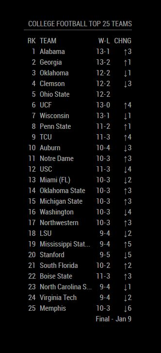

# Module: College Football Top 25
The `MMM-CollegeFootballTop25` module displays the Top 25 College Football Teams based on the Associate Press Polling.

Example:

 

## Dependencies / Requirements

This module requires the use of the `ap-top25-ncaaf` package for node.js. To install this please run `npm install ap-top25-ncaaf` from the MMM-CollegeFootballTop25 module directory inside your Magic Mirror installation directory.

## Operation

This module is straight-forward to use and requires no special configuration other than standard Magic Mirror positioning. 

To make a smaller, more efficent display, you can use the "teamsToShowAtATime" configuration option to limit the number of teams show at a time, and thus the height. Using less columns in the "columnOrder" configuration option will reduce the width. Changing the "textClass" value can increase or decrease the text size of the table.

All configuration options are optional, see below for more.

## Configuration options

The following properties can be configured:

<table width="100%">
	<!-- why, markdown... -->
	<thead>
		<tr>
			<th>Option</th>
			<th width="100%">Description</th>
		</tr>
	<thead>
	<tbody>	
		<tr>
			<td><code>headerText</code></td>
			<td>String value, the header text to be shown above the rankings table. If set to '', then no header will be shown. 
				 <b>Example:</b> <code>'AP Top 25'</code>
				 <b>Default value:</b> <code>'College Football Top 25 Teams'</code>
				 This value is <b>OPTIONAL</b>
			</td>
		</tr>		
		<tr>
			<td><code>teamsToShowAtATime</code></td>
			<td>Integer value, this determines number of teams in the poll to show at a time. If 25, all teams will be shown. If less than 25, the specified number of teams will be shown before refreshing on screen to show the next number of teams, repeating until all teams have been shown. Well any number between 1 or 25 can be specified, using 5, 10, or 25 will yield best results. 
				 <b>Example:</b> <code>5</code>
				 <b>Default value:</b> <code>25</code>
				 This value is <b>OPTIONAL</b>
			</td>
		</tr>
		<tr>
			<td><code>columnOrder</code></td>
			<td>List of strings values, where each string in the list is a column (a data point about that ranked team) in the poll. Available options are 'rank', 'name', 'conference', 'record', 'previous_rank', 'rank_change', and 'points'.  The columns will be rendered in the order specified in the list. 
				 <b>Example:</b> <code>[ 'rank_change', 'rank', 'name', 'record', 'conference', ]</code>
				 <b>Default value:</b> <code>[ 'rank', 'name', 'record', 'rank_change', ]</code>
				 This value is <b>OPTIONAL</b>
			</td>
		</tr>
		<tr>
			<td><code>showColumnHeaders</code></td>
			<td>Boolean value, sets whether or not the column headers will be shown at the top of the table or not. 
				 <b>Example:</b> <code>false</code>
				 <b>Default value:</b> <code>true</code>
				 This value is <b>OPTIONAL</b>
			</td>
		</tr>   
		<tr>
			<td><code>showPollWeekAndDate</code></td>
			<td>Boolean value, sets whether or to show the week and date of the poll, for instance "Week 3 - Sep 15". If set to true this value will be shown at the bottom right of the table. 
				 <b>Example:</b> <code>false</code>
				 <b>Default value:</b> <code>true</code>
				 This value is <b>OPTIONAL</b>
			</td>
		</tr>   		
        <tr>
			<td><code>textClass</code></td>
			<td>String value, sets the class of the table body, i.e. what the text looks like. This class is set from the values in the Magic Mirror 'main.css' file. 
				 <b>Example:</b> <code>'small'</code>
				 <b>Default value:</b> <code>'xsmall'</code>
				 This value is <b>OPTIONAL</b>
			</td>
		</tr>
        <tr>
			<td><code>maxTeamNameLength</code></td>
			<td>Integer value, the max length of a team name. Any name longer than this value will be truncated to this value and have a "..." added to it. 
				 <b>Example:</b> <code>6</code>
				 <b>Default value:</b> <code>16</code>
				 This value is <b>OPTIONAL</b>
			</td>
		</tr>      
        <tr>
			<td><code>maxConferenceNameLength</code></td>
			<td>Integer value, the max length of a conference name. Any name longer than this value will be truncated to this value and have a "..." added to it. 
				 <b>Example:</b> <code>8</code>
				 <b>Default value:</b> <code>10</code>
				 This value is <b>OPTIONAL</b>
			</td>
		</tr>
		<tr>
			<td><code>highlightTeams</code></td>
			<td>List of strings value. Each string in the list is two parts, a team name and a color value, seperated by a "::". The format is defined as "Team Name::#RRGGBB". If the team name part matches the ranked team name than the color value will be used across that row of the team instead of the usual color. Note that the specified team name must match the team name as dervied from the AP Top 25 Poll, so you may need to get some sample results before defining this. 
				 <b>Example:</b> <code>[ 'Virginia Tech::#6a2c3e', ]</code>
				 <b>Default value:</b> <code>[ ]</code>
				 This value is <b>OPTIONAL</b>
			</td>
		</tr>	
		<tr>
			<td><code>colorRankChange</code></td>
			<td>Boolean value, determines if the rank change column (the difference rank between this week and last week) should be colorized. If set to true will color increases in rank as green and decreases in rank as red. 
				 <b>Example:</b> <code>true</code>
				 <b>Default value:</b> <code>false</code>
				 This value is <b>OPTIONAL</b>
			</td>
		</tr>
		<tr>
			<td><code>onScreenRefreshRate</code></td>
			<td>Integer value, the delay between changing the on-screen displayed teams for the next set. In milliseconds. Only used when the teamsToShowAtATime value is less than 25. 
				 <b>Example:</b> <code>15000</code>
				 <b>Default value:</b> <code>6000</code>
				 This value is <b>OPTIONAL</b>
			</td>
		</tr>		
		<tr>
			<td><code>animationSpeed</code></td>
			<td>Integer value, the animation speed sent to updateDom to fade in between new sets of on-screen teams. In milliseconds. Only used when the teamsToShowAtATime value is less than 25. 
				 <b>Example:</b> <code>4500</code>
				 <b>Default value:</b> <code>3000</code>
				 This value is <b>OPTIONAL</b>
			</td>
		</tr>
    </tbody>
</table>
